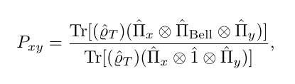
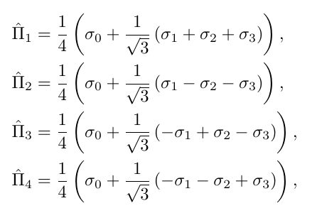
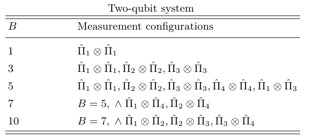

# Datasets

This directory contains the datasets used throughout the project.

## Contents

- `datasets_generation.ipynb`: Jupyter notebook used to generate the datasets.
- `ds_haar_op.csv`: Dataset of 4x4 unitary operator entries used to generate quantum states.
- `ds_haar_obs.csv`: Dataset obrained by applying collective measurements to the states generated with `ds_haar_op.csv`.
- `ds_mixed_dm.csv`: Dataset of randomly generated density matrices.
- `ds_mixed_obs.csv`: Dataset obrained by applying collective measurements to the states generated with `ds_mixed_dm.csv`.

## Datasets generation

### Unitary operators

To generate `ds_haar_op.csv`, random unitary operator are used. The operators are applied to the state |00> and the resulting state is checked for entanglement.
Entanglement is detected using the _Schmidt decomposition_.
The density matrix of the resulting state is then calculated and the Schmidt rank is used to determine if the state is separable or entangled
(If the Schmidt rank is 1, the state is separable).

Random operators are sampled from the unitary Haar measure [1].

In particular, generating a random 4x4 unitary operator has a low probability of generating a separable state.
For this reason, the unitary has 1/2 probaility of being generated as the tensor product of two 2x2 unitary operators,
like in the following pseudocode:

```pseudocode
function generate_unitary():
    if random() < 0.5:
        U1 = random_2x2_unitary()
        U2 = random_2x2_unitary()
        U = U1 ⊗ U2
    else:
        U = random_4x4_unitary()
    return U
end
```

### Density matrices

To generate `ds_mixed_dm.csv`, random density matrices are used.
Density matrices are generated as $U^\dagger \rho U$, where $U$ is a random unitary operator and $\rho$ is a diagonal matrix that satisfies $Tr[\rho]=1$.
This is the same process used by Trávníček et al. in [2].
The density matrices are checked for entanglement using the _Negativity Criterion_.

### Observables

The datasets `ds_haar_obs.csv` and `ds_mixed_obs.csv` are obtained by applying collective measurements to the states generated with `ds_haar_op.csv` and `ds_mixed_dm.csv`, respectively.
The collective measurements are the same used in [2].
Each feature is the probability of successfully projecting onto a singlet Bell state, given a particular pair of local projections.
This is represented by the equation



Where $\Pi_x$ and $\Pi_y$ are the local projectors, $\Pi_{Bell}$ is the singlet Bell state projector, and $\rho_T = \rho \otimes \rho$ is the state to be measured.
The projectors are defined as


Different features are obtained as the result of different combinations of local projectors.
The combinations are as follows




## References

[1] [Qiskit's random unitary](https://docs.quantum.ibm.com/api/qiskit/0.19/qiskit.quantum_info.random_unitary)

[2] Vojtěch Trávníček, Jan Roik, Karol Bartkiewicz, Antonín Černoch, Paweł Horodecki, and Karel Lemr, "Sensitivity versus selectivity in entanglement detection via collective witnesses" (2023)
