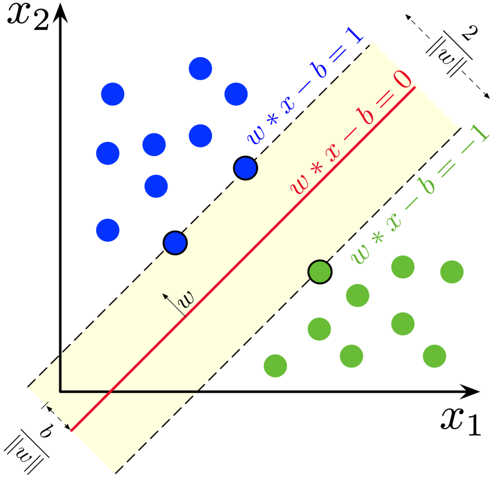
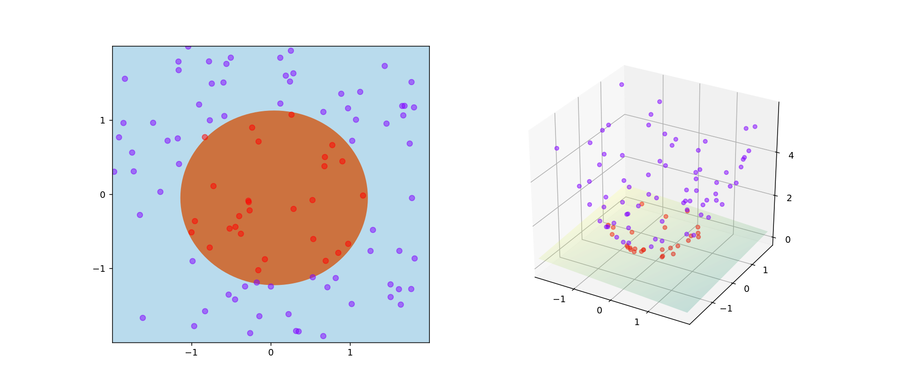

# Quantum Support Vector Machines

In this directory notebooks that use _Quantum Support Vector Machines" (QSVM) are kept.

## Algorithms Description

A _support vector machine_ (SVM) is a machine learning method for classification.
The idea is to find a hyperplane that separates the data based on the label.
The hyperplane is required to be the most far away from the data as possible, _maximizing the margin_.

Effectiveness of the SVM depends on the data distribution as the data may not be linearly separable.
To avoid this problem the **kernel trick** is employed.
Data is trasformed with a mapping $\phi$ to a space where the it is linearly separable.
The kernel function is given by $k(x_i, x_j) = \langle \phi(x_i), \phi(x_j) \rangle$

The trick consists in the fact that the actual mapping $\phi$ is not explicitely required (under certain conditions),
as is can be implicitely defined by $k$.

The main advantage (and disadvantage) of kernel base methods is that the exponential complexity doesn't increase with the number of features,
but increases (cubicly) with the number of examples,
since the **Gram matrix K** is required, where $K_{ij} = k(x_i, x_j)$

A **quantum** svm employes _feature maps_ that map the classical data to quantum states.
The kernel is then computed on the quantum states.
For example as $k(x_i, x_j) = \left| \langle \phi(x_i) | \phi(x_j) \rangle \right|^2 $

## Contents

- The main notebook in the subdirectory is `qsvm_haar_obs.ipynb` where the method is applied to the `ds_haar_obs.csv` dataset
 (obtained by applieng the observables to pure states), the others being variations.
- `qsvm.py` contains the functions used in the main notebook.
- `qsvm_haar_obs_penny.ipynb` is an implementation of the algorithm using _pennylane_.
- `qsvm_mixed_obs.ipynb` applies the method to the mixed states
